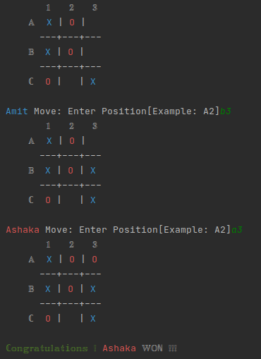

# TIC TAC TOE

> A game between two players that decides a winner when you get your token `X or O` lined up in any direction.

This game requires two players and both players select different tokens `X or O` . Players take turns placing their tokens on a 3x3 grid board with their desired position, the first player to get their token aligned horizontally, vertically or diagonally becomes the winner. This game is modified differently in how players select their positions; Example[A1, B3, C2] are intersect positions used to decide where the token will be placed.

## Instructions
- run `bin/main.rb` from the tictactoe folder
- Enter player names (players 1 & 2)
- choose token `(X or O)` recommended
- game starts and player 1 decides position by choosing row and column(example: A1, B2)
- player 2 takes the next turn and chooses position
- repeat the turns till there is a winner or tie!
- winner is decided by having his token lined up in any direction
- tie is decided when the board is filled with no matching token lined up in any direction.

  
  
  

## Built With

### Prerequisites

- `Ruby`

### Install

- install ruby `$ sudo apt-get install ruby-full` for **linux users**
- download [RUBY](https://github.com/oneclick/rubyinstaller2/releases/download/RubyInstaller-2.7.2-1/rubyinstaller-devkit-2.7.2-1-x64.exe) and install for **windows users**

## To get a local copy up and running follow these simple example steps.

- git clone `git@github.com:AshakaE/TicTacToe.git`
- git checkout -b game-play
- cd tictactoe
- run `bin/main.rb`

## Authors

👤 **Amit**

- GitHub: [@githubhandle](https://github.com/KumarAmitt)
- Twitter: [@twitterhandle](https://twitter.com/ArrshAmitt)
- LinkedIn: [LinkedIn](https://www.linkedin.com/in/kumar-amitt)

👤 **Ashaka**

- GitHub: [@githubhandle](https://github.com/AshakaE)
- Twitter: [@twitterhandle](https://twitter.com/shaqzee_)
- LinkedIn: [LinkedIn](https://www.linkedin.com/in/ashaka-egerega-92a8b41b3/)

## 🤝 Contributing

Contributions, issues, and feature requests are welcome!

## Show your support

Give a ⭐️ if you like this project!

## Acknowledgments

- Hat tip to [Microverse](https://www.microverse.org/) for the readme template

## 📝 License

Copyright (c) 2021 Amit and Ashaka

Permission is hereby granted, free of charge, to any person obtaining a copy
of this software and associated documentation files (the "Software"), to deal
in the Software without restriction, including without limitation the rights
to use, copy, modify, merge, publish, distribute, sublicense, and/or sell
copies of the Software, and to permit persons to whom the Software is
furnished to do so, subject to the following conditions:

The above copyright notice and this permission notice shall be included in all
copies or substantial portions of the Software.

THE SOFTWARE IS PROVIDED "AS IS", WITHOUT WARRANTY OF ANY KIND, EXPRESS OR
IMPLIED, INCLUDING BUT NOT LIMITED TO THE WARRANTIES OF MERCHANTABILITY,
FITNESS FOR A PARTICULAR PURPOSE AND NONINFRINGEMENT. IN NO EVENT SHALL THE
AUTHORS OR COPYRIGHT HOLDERS BE LIABLE FOR ANY CLAIM, DAMAGES OR OTHER
LIABILITY, WHETHER IN AN ACTION OF CONTRACT, TORT OR OTHERWISE, ARISING FROM,
OUT OF OR IN CONNECTION WITH THE SOFTWARE OR THE USE OR OTHER DEALINGS IN THE
SOFTWARE.
